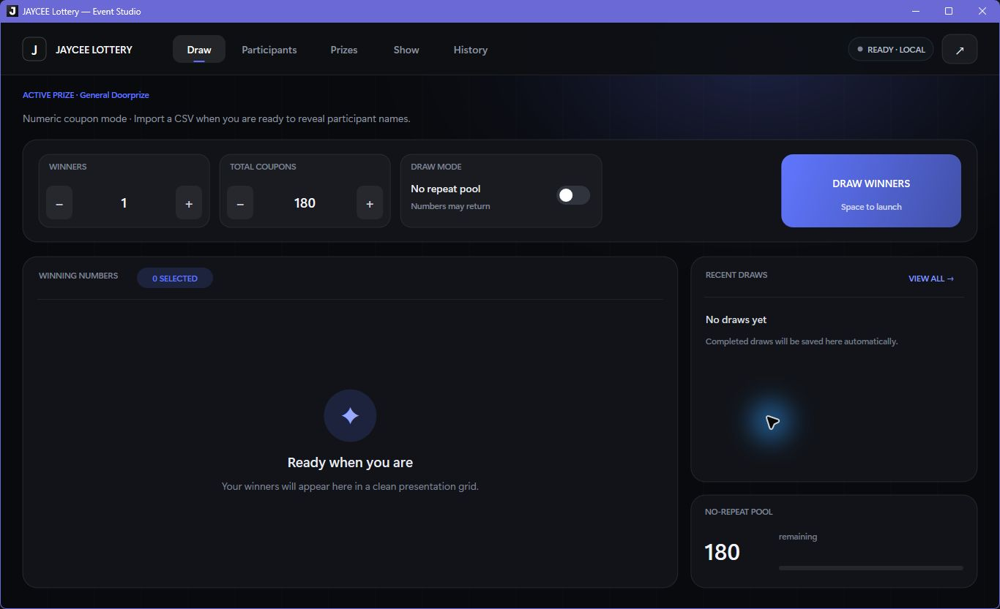
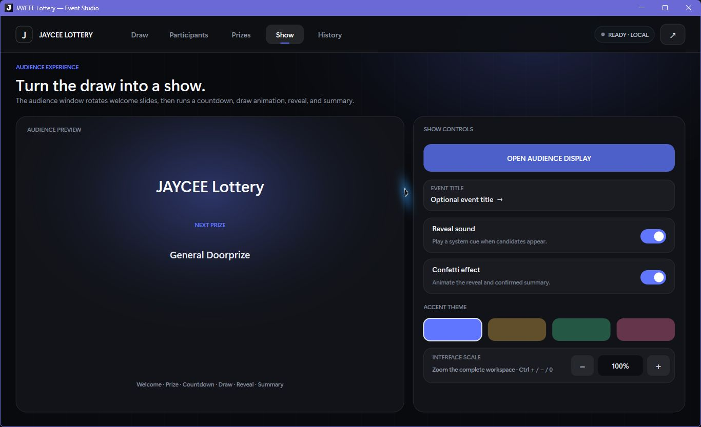

# JAYCEE Lottery

<p align="center">
  
</p>

<p align="center">
  A modern, native Windows lottery draw studio for live events.
</p>

<p align="center">
  
  
  
</p>

JAYCEE Lottery combines an operator dashboard, participant and prize management, confirmed draw history, CSV reporting, and a separate audience presentation window in one lightweight C++ application. It runs without Python, Qt, a browser runtime, or another interpreter.



## Download and install

For another Windows computer, open the [latest GitHub release](https://github.com/ZengLLQ/JAYCEE-Lottery/releases/latest) or use one of the repository files below:

- **Recommended:** [`JAYCEE-Lottery-Setup.exe`](dist/JAYCEE-Lottery-Setup.exe) — installs per user, creates Start Menu and uninstall entries, and can create a desktop shortcut.
- **Portable executable:** [`JAYCEE Lottery.exe`](dist/JAYCEE%20Lottery.exe) — run directly without installation.
- **Portable package:** [`JAYCEE-Lottery-portable.zip`](dist/JAYCEE-Lottery-portable.zip) — extract it anywhere and launch the executable.

The release targets 64-bit Windows 10 and Windows 11. The setup executable is not digitally signed, so Windows SmartScreen may identify it as an unknown publisher.

## Features

- Numeric coupon draws or named participant draws from UTF-8 CSV files.
- One or multiple winners per draw.
- Candidate review with **Confirm** and **Redraw** before results are committed.
- Optional no-repeat pool across confirmed draws.
- Prize management with default winner counts and group eligibility.
- Local draw history with UTF-8 CSV export.
- Separate audience display with welcome slides, prize preview, countdown, reveal, sound, and confetti.
- Four accent themes and a clean dark interface.
- Optional real-time 3D motion system with parallax lighting, perspective depth, hover lift, page transitions, and cinematic winner reveals.
- Interface scaling from 75% to 135% plus mouse-wheel page scrolling.
- Local autosave with no server, login, tracking, or internet requirement.

## Quick start

1. Install the application or launch the portable executable.
2. On **Draw**, choose the winner count and coupon total.
3. Optional: open **Participants** and import a CSV to display names instead of numbers.
4. Optional: configure prize names and eligibility on **Prizes**.
5. Press `Space` or select **Draw Winners**. Review the candidates, then confirm or redraw.
6. Use **Show** to open the audience display on a projector or second monitor.
7. Export the confirmed results from **History**.

For complete operating instructions, see the [User Guide](docs/USER_GUIDE.md).

## Audience experience



The audience display automatically opens fullscreen on a second monitor when one is available. Otherwise, it opens as a resizable preview window. Its sequence includes welcome, next-prize and pool slides, then countdown, draw animation, reveal, and confirmed summary states.

## Keyboard and navigation

| Shortcut | Action |
| --- | --- |
| `Space` | Start a draw or confirm waiting candidates |
| `N` | Toggle the no-repeat pool |
| `Ctrl+D` / `Ctrl+I` / `Ctrl+P` | Open Draw / Participants / Prizes |
| `Ctrl+S` / `Ctrl+H` | Open Show / History |
| `Ctrl++` / `Ctrl+-` | Increase / decrease interface scale |
| `Ctrl+0` | Reset interface scale to 100% |
| Mouse wheel | Scroll the page or the list under the pointer |
| `F11` | Toggle fullscreen |
| `Esc` | Close a dialog, cancel editing, or leave fullscreen |

## Documentation

- [User Guide](docs/USER_GUIDE.md)
- [Participant CSV Format](docs/CSV_FORMAT.md)
- [Build from Source](docs/BUILDING.md)
- [Changelog](CHANGELOG.md)

## Build from source

From PowerShell:

```powershell
./build-release.ps1
```

The script detects MinGW-w64 or Visual Studio, builds the app and custom installer through CMake, and places release files in `dist/`. See [Build from Source](docs/BUILDING.md) for requirements and manual commands.

## Local data and privacy

Application data is stored only on the current computer:

```text
%LOCALAPPDATA%\JAYCEE Lottery\lottery_state.txt
```

Copy this file to back up the event configuration, participants, draw history, and no-repeat pool. Uninstalling the application intentionally keeps this file so event records are not destroyed accidentally.

## Technology

The application is written in C++20 using the Win32 API, Direct2D, and DirectWrite. Release builds use a static C/C++ runtime and Windows system libraries, keeping deployment small and interpreter-free.
